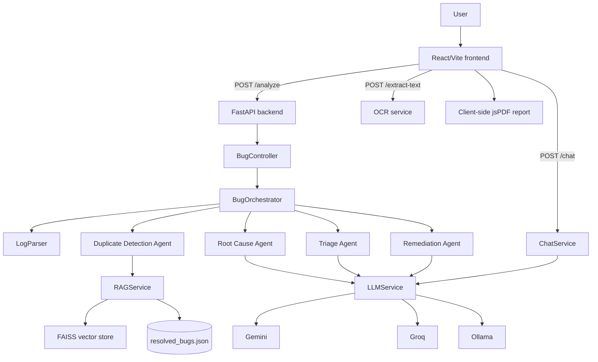

# Creation of Intelligent Bug Diagnosis Platform with Fix Recommendation Assistance Advisor

AI-powered bug diagnosis and fix-recommendation platform.

## Project overview

Smart Bug Analyzer accepts error descriptions, stack traces, logs, uploaded text files, and screenshots. A FastAPI backend coordinates a multi-agent analysis pipeline, while a React/Vite frontend presents triage, log details, root cause, historical matches, remediation, reports, and follow-up assistance in one workflow.

The project combines structured parsing, retrieval-augmented generation (RAG), FAISS similarity search, configurable LLM providers, OCR, and browser-based analysis history.

## Problem statement

Debugging information is often spread across logs, screenshots, historical tickets, and separate developer tools. This makes diagnosis slow and causes repeated investigation of known issues. Smart Bug Analyzer brings those activities together and returns a consistent explanation, severity assessment, historical context, and recommended fix.

### Objectives

- Accept bug reports through paste, text-file upload, and screenshot OCR.
- Extract exception, file, and line information from common stack-trace formats.
- Coordinate multiple reasoning agents for triage, root cause, duplicate detection, and remediation.
- Ground explanations and fixes in a searchable resolved-bug knowledge base.
- Provide an LLM provider fallback chain without exposing credentials in the frontend.
- Keep completed analyses available through history, reports, dashboard insights, and contextual chat.
- Produce a readable PDF report for a completed analysis.

## Key features

- Paste error logs, stack traces, or a natural-language bug description.
- Upload `.txt`, `.log`, `.md`, and `.json` text files up to 10 MB.
- Upload PNG, JPEG, WEBP, or GIF screenshots and extract text through local Tesseract OCR.
- Parse Java, Python, JavaScript, TypeScript, C/C++, Go, and Rust source locations.
- Five-stage pipeline: Triage, Log Analysis, Root Cause, Duplicate Detection, and Remediation.
- Severity and priority classification with a written triage reason.
- RAG-backed root-cause explanations and semantic historical-bug matches.
- FAISS-backed knowledge-base search, severity filtering, manual resolved-bug entry, duplicate prevention, index statistics, and rebuild support.
- Remediation output containing recommended fix, code suggestion, confidence, steps, and prevention guidance.
- Gemini → Groq → Ollama provider selection with request-scoped provider locking and safe error messages.
- Context-aware assistant chat for questions about the current diagnosis.
- Analysis History and Reports views backed by browser local storage.
- PDF report download with normalized text, wrapped paragraphs, and page-aware sections.
- Dashboard with recent analyses, severity insights, circular distribution chart, and Week/Month selection.
- Light and dark themes, responsive layout, sidebar navigation, clear/reset action, and scroll-to-top button.

## System architecture



## End-to-end workflow

1. The user pastes a report, uploads a text file, or selects a screenshot.
2. The frontend validates file type, file size, and the 5,000-character analysis limit.
3. Screenshot input is sent to `POST /extract-text`; OCR output is placed into the existing analysis box.
4. The frontend sends the final report to `POST /analyze`.
5. `BugController` loads the historical bug collection, creates a request-scoped RAG service and LLM service, and starts the orchestrator.
6. `LogParser` extracts exception, source file, and line number.
7. Duplicate Detection searches historical bugs through embeddings and FAISS.
8. Root Cause, Triage, and Remediation agents use the shared LLM provider selected for that request.
9. A sufficiently new bug is persisted and added to the live FAISS index.
10. The frontend stores the completed entry in browser history and reports, then opens the dashboard view.
11. The user can inspect findings, ask contextual questions, manage the knowledge base, or download a PDF report.

## Backend and multi-agent architecture

### FastAPI application

`app/main.py` owns request validation, CORS for the local Vite client, analysis requests, screenshot extraction, knowledge-base operations, and chat requests. It delegates diagnosis to `BugController` and returns JSON responses to the frontend.

### Orchestrator

`app/agents/orchestrator.py` coordinates this pipeline:

1. Parse the report with `LogParser`.
2. Find similar historical bugs.
3. Build historical context for the matched records.
4. Generate a root-cause explanation.
5. Classify severity and priority.
6. Generate remediation and prevention guidance.
7. Persist and index the report when it is sufficiently different from existing records.

### Agents and major components

| Component | Input | Output | Purpose |
|---|---|---|---|
| `LogParser` | Error text or stack trace | Exception, file, line | Extracts structured log information. |
| `DuplicateDetectionAgent` | Bug report | Similarity-ranked bugs | Finds historical matches through RAG. |
| `RootCauseAgent` | Report and historical context | Root cause, explanation, confidence | Explains the likely failure mechanism. |
| `TriageAgent` | Report and root cause | Severity, priority, reason | Classifies business and technical impact. |
| `RemediationAgent` | Report, root cause, historical context | Fix, code suggestion, steps, prevention | Provides actionable repair guidance. |
| `BugOrchestrator` | All pipeline inputs | Unified analysis result | Coordinates agents and knowledge-base growth. |
| `ChatService` | Analysis and conversation | Assistant answer | Answers contextual follow-up questions. |
| `KnowledgeBase` | `resolved_bugs.json` | Bug records | Loads, validates, appends, and allocates bug IDs. |
| `RAGService` | Historical bugs and query | Similarity matches | Creates embeddings and queries FAISS. |

## Input and parser support

`app/parser/log_parser.py` supports these source extensions:

- Java: `.java`
- Python: `.py`
- JavaScript/React: `.js`, `.jsx`
- TypeScript: `.ts`, `.tsx`
- C and C++: `.c`, `.cc`, `.cpp`, `.cxx`, `.h`, `.hpp`
- Go: `.go`
- Rust: `.rs`

The parser recognizes Java and JavaScript-style stack frames, Python traceback locations, compiler/runtime locations, panic messages, common exception/error names, segmentation faults, and assertion failures.

## AI and LLM architecture

`app/services/llm_service.py` centralizes provider access. The provider order is:

```text
Gemini
  ↓ unavailable key, SDK/API error, timeout, or provider failure during selection
Groq
  ↓ failure during selection
Ollama
```

The first successful provider is locked for the current analysis request so every reasoning agent uses the same provider. If that selected provider fails later in the same request, the service raises a safe analysis error rather than silently mixing providers between agents.

### Environment variables

| Variable | Purpose |
|---|---|
| `GEMINI_API_KEY` | Optional Gemini credential. |
| `GROQ_API_KEY` | Optional Groq credential. |
| `OLLAMA_BASE_URL` | Local Ollama server URL. |
| `OLLAMA_MODEL` | Local Ollama model name. |
| `VITE_API_URL` | Frontend URL for the FastAPI backend; defaults to `http://127.0.0.1:8000`. |

Copy `.env.example` to `.env` and replace only the backend placeholders. Keep `.env` local and never commit it.

## RAG and knowledge base

The persisted knowledge base is `data/resolved_bugs/resolved_bugs.json`. Each record contains a bug ID, title, description, severity, priority, module, exception, stack trace, root cause, resolution, and tags.

The RAG service loads historical bug records, creates sentence embeddings, stores vectors in an in-memory FAISS index, returns similarity-ranked matches, and adds sufficiently new analyzed bugs to the JSON file and live index.

The Knowledge Base page supports semantic search, severity filtering, manual resolved-bug entry, duplicate checks, vector counts, embedding dimension, severity counts, and FAISS rebuild.

## Screenshot OCR

`POST /extract-text` accepts image uploads up to 10 MB. The OCR service validates the image, invokes the local Tesseract executable, limits extracted text to 5,000 characters, and returns clear errors when Pillow, Tesseract, or readable text is unavailable.

Install Tesseract separately on macOS with:

```bash
brew install tesseract
```

On Linux, install the equivalent `tesseract-ocr` system package.

## History, reports, and PDF output

The React frontend stores up to 30 recent analysis entries in `smart-bug-history` for History and `smart-bug-reports` for Reports. The two views have independent deletion actions.

`frontend/react/src/services/reportPdf.js` generates a client-side PDF containing the submitted report, triage, log analysis, root cause, similar bugs, remediation, and overall summary. Text is normalized, wrapped, and placed across pages to avoid clipping.

## Frontend architecture

The React/Vite client is in `frontend/react/src/`.

| Frontend area | Responsibility |
|---|---|
| `App.jsx` | Navigation, input flows, state, local storage, dashboard, and theme switching. |
| `Pipeline.jsx` | Multi-agent progress cards and stage status. |
| `Results.jsx` | Expandable bug-analysis sections and report download. |
| `KnowledgeBaseView.jsx` | Search, filters, statistics, rebuild, and manual entries. |
| `HistoryView.jsx` | Searchable and filterable analysis history. |
| `ReportsView.jsx` | Report list, download, view, and delete actions. |
| `Chatbot.jsx` | Contextual assistant conversation and Enter-to-send behavior. |
| `api.js` | Frontend calls to the FastAPI endpoints. |
| `reportPdf.js` | Client-side PDF generation. |
| `styles.css` | Light/dark theme, responsive layout, cards, hover states, and dashboard styling. |

## API surface

| Method | Endpoint | Purpose |
|---|---|---|
| `GET` | `/` | Health message. |
| `POST` | `/analyze` | Run the multi-agent bug analysis. |
| `POST` | `/extract-text` | Extract text from a screenshot with OCR. |
| `GET` | `/knowledge-base` | List, filter, or semantically search historical bugs. |
| `GET` | `/knowledge-base/stats` | Return FAISS and severity statistics. |
| `POST` | `/knowledge-base/rebuild` | Rebuild the in-memory FAISS index. |
| `POST` | `/knowledge-base` | Add a resolved bug manually. |
| `POST` | `/chat` | Ask a contextual assistant question. |

## Technology stack

| Technology | Use |
|---|---|
| Python | Backend, agents, parsing, RAG, OCR integration, and tests. |
| FastAPI + Uvicorn | HTTP API and local backend server. |
| Pydantic | API request and response models. |
| React + Vite | Frontend dashboard and user workflow. |
| FAISS | Similarity search over historical bugs. |
| Sentence Transformers | Text embeddings for RAG retrieval. |
| Gemini, Groq, Ollama | LLM provider chain. |
| Pillow + Tesseract | Screenshot OCR. |
| jsPDF | Browser-side PDF report generation. |
| Local Storage | Browser persistence for history and reports. |

## Project directory structure

```text
SmartBugAnalyzer/
├── app/
│   ├── agents/
│   ├── api/
│   ├── models/
│   ├── parser/
│   ├── rag/
│   ├── services/
│   └── main.py
├── data/
│   └── resolved_bugs/resolved_bugs.json
├── Documentation/
│   ├── Agile_Template_v0.1.xlsm
│   ├── Defect_Tracker Template_v0.1.xlsx
│   └── Unit_Test_Plan_v0.1.xlsx
├── frontend/
│   ├── components/
│   ├── css/
│   ├── react/
│   └── streamlit_app.py
├── tests/
├── .env.example
├── .gitignore
├── requirements.txt
└── README.md
```

## Setup and configuration

### Backend

From the repository root:

```bash
python3 -m venv venv
source venv/bin/activate
python -m pip install -r requirements.txt
cp .env.example .env
```

Edit `.env` with the provider configuration you want to use. At least one LLM provider should be configured for live AI analysis.

### Run the FastAPI backend

```bash
uvicorn app.main:app --reload
```

The API listens on `http://127.0.0.1:8000` by default.

### Run the React frontend

In a second terminal:

```bash
cd frontend/react
cp .env.example .env.local
npm install
npm run dev
```

Open the Vite URL shown in the terminal, usually `http://localhost:5173`.

### Run Ollama locally

If Ollama is being used as a provider fallback:

```bash
ollama serve
ollama pull llama3.2
```

Keep `OLLAMA_BASE_URL` and `OLLAMA_MODEL` aligned with the installed model.

## Tests and checks

From the repository root with the virtual environment active:

```bash
python -m unittest discover -s tests -p 'test_*.py'
```

Useful focused checks include:

```bash
python -m unittest tests.test_parser
python -m unittest tests.test_chat_service
python -m unittest tests.test_knowledge_base_growth
```

Build the frontend before publishing:

```bash
cd frontend/react
npm run build
```

## Example analysis workflow

1. Start the FastAPI backend and React frontend.
2. Open Analyze Bug.
3. Paste a stack trace, upload a text file, or upload a screenshot.
4. Select Analyze Bug.
5. Review triage, log details, root cause, historical matches, and remediation.
6. Open the dashboard to review recent analyses and insights.
7. Ask a follow-up question in AI Assistant.
8. Browse or update the Knowledge Base.
9. Download the completed PDF report.

## Security considerations

- API keys are loaded from backend environment variables and are never placed in React source files.
- `.env`, virtual environments, caches, frontend dependencies, and build output are excluded from Git.
- Uploaded screenshots are limited to 10 MB and extracted text is limited to 5,000 characters.
- Knowledge-base entries are checked for duplicate IDs and duplicate title-description pairs.
- LLM error messages do not expose credentials.
- RAG responses are guidance and should be reviewed by a developer before production changes are made.
